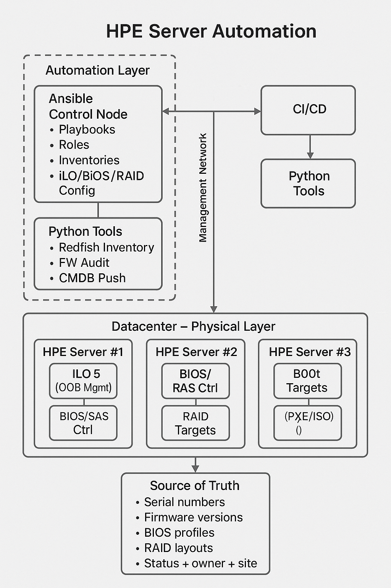

# HPE Server Automation

Production-style repository for automating HPE physical servers (ProLiant / Synergy)
using Ansible, Redfish (iLO), and Python tooling.

## Topology

The credit of this Lifecycle Automation goes to ChatGPT

## Features

- iLO bootstrap (accounts, password rotation, disable default)
- iLO configuration (NTP, DNS, HTTPS)
- BIOS profile enforcement from JSON
- RAID / storage discovery (extendable for SmartArray)
- OS deployment trigger via virtual media
- Post-install hardening on the OS
- Compliance audit (firmware / BIOS)
- Python tools for Redfish inventory + NetBox CMDB sync
- GitLab CI pipeline for linting and scheduled audits

## Quick Start

```bash
git clone <your-repo-url>.git hpe-server-automation
cd hpe-server-automation/ansible

# Install dependencies
pip install ansible ansible-lint yamllint requests
ansible-galaxy collection install community.general

# Adjust inventory and group_vars
$EDITOR inventory/hosts.yml
$EDITOR group_vars/all.yml

# Run a lab audit in check mode
ansible-playbook playbooks/05_audit_compliance.yml -i inventory/hosts.yml --limit lab --check
```

## Layout

- `ansible/` – playbooks, roles, inventories for iLO + OS
- `python-tools/` – helper scripts (inventory + CMDB)
- `ci-cd/.gitlab-ci.yml` – GitLab pipeline
- `docs/` – architecture & baseline examples
